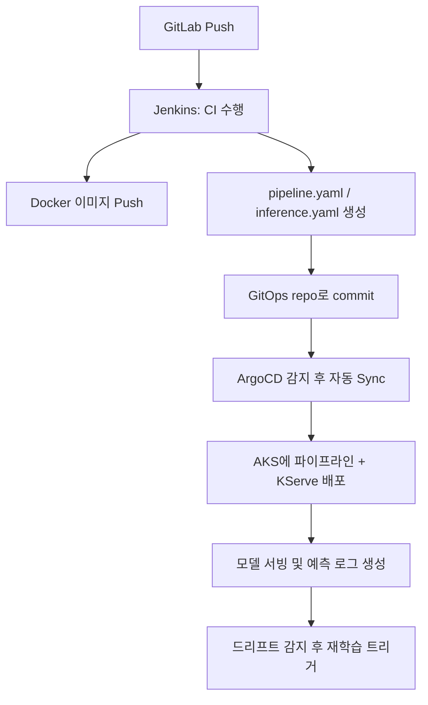

# ☁️ Kubeflow MLOps 자동화 설계: ArgoCD + GitLab + Jenkins 연동 가이드 (for Azure AKS)

이 문서는 **Kubeflow 기반의 MLOps 파이프라인을 자동화**하기 위해
`ArgoCD`, `GitLab`, `Jenkins`를 **Azure Kubernetes Service (AKS)** 환경에 통합하는 방법을 설명합니다.

> 🧑‍🏫 **목표 독자**: 쿠버네티스와 MLOps에 익숙하지 않은 개발자/엔지니어

---

## 🎯 최종 목표

```
[GitLab Commit/Push]
       ↓
[Jenkins CI: 테스트, YAML 생성, 이미지 빌드 & Push]
       ↓
[GitLab Merge → GitOps repo 반영]
       ↓
[ArgoCD가 AKS에 자동 배포]
       ↓
[Kubeflow Pipeline/KServe로 운영]
       ↓
[모델 학습 + 평가 + 배포 + 드리프트 감지 → 재학습]
```

---

## 📦 주요 구성 요소

| 구성 요소 | 설명 |
|------------|------|
| **GitLab** | 코드 저장소 + GitOps 저장소 역할 |
| **Jenkins** | CI (테스트, Docker 빌드, YAML 생성) |
| **ArgoCD** | GitOps 방식으로 K8s에 배포 자동화 |
| **Kubeflow Pipelines** | ML 워크플로우 실행 플랫폼 |
| **KServe** | 모델 서빙 시스템 (Kubernetes 기반) |
| **Azure AKS** | MLOps 인프라를 호스팅하는 K8s 클러스터 |


---

## ⚙️ 1. GitLab 구성

### 🔸 1.1 코드 저장소 구성

```
📁 mlops-repo/
├── components/               # Kubeflow 컴포넌트 코드
├── pipeline/                 # pipeline.py, compile_pipeline.py
├── serving/                  # Dockerfile, model_server.py
├── monitoring/               # drift_detector.py
├── .gitlab-ci.yml            # CI 파이프라인 스크립트
```

### 🔸 1.2 GitOps 저장소 구성

```
📁 mlops-deploy-config/
├── inference-service.yaml    # KServe 리소스
├── pipeline.yaml             # 컴파일된 파이프라인
```

> ✅ GitOps 저장소는 ArgoCD가 감시하는 대상입니다.

---

## ⚙️ 2. Jenkins 구성 (CI 담당)

### 🔸 2.1 Jenkins 작업 흐름

1. GitLab 저장소 푸시 트리거 감지
2. `pipeline/compile_pipeline.py` 실행 → `pipeline.yaml` 생성
3. `serving/Dockerfile`로 이미지 빌드 → ACR(Azure Container Registry)에 Push
4. 최신 `pipeline.yaml`과 `inference-service.yaml`을 GitOps 저장소에 자동 Commit/Push

### 🔸 2.2 CI 위치 및 실행 환경

- Jenkins는 **외부 서버 혹은 AKS 내에 설치** 가능
- Jenkins가 실행하는 모든 명령은 **컨테이너 빌드/커맨드 실행이 가능한 머신에서 실행**됨
- Jenkins는 `kubectl` 또는 `az` CLI 사용 가능해야 함 (필요시 Service Account 연동)

---

## ⚙️ 3. ArgoCD 구성 (CD 담당)

### 🔸 3.1 ArgoCD 기본 개념

- ArgoCD는 **Git 저장소에 정의된 YAML(K8s 리소스)** 를 주기적으로 감시합니다.
- 변경 사항이 감지되면, 이를 Kubernetes 클러스터에 **자동으로 배포**합니다.

### 🔸 3.2 적용 예시

```yaml
apiVersion: argoproj.io/v1alpha1
kind: Application
metadata:
  name: iris-mlops
spec:
  destination:
    namespace: default
    server: https://kubernetes.default.svc
  source:
    repoURL: https://gitlab.com/your-org/mlops-deploy-config.git
    path: .
    targetRevision: main
  project: default
  syncPolicy:
    automated:
      prune: true
      selfHeal: true
```

### 🔸 3.3 ArgoCD 실행 위치
- ArgoCD는 **AKS 클러스터 내부의 Pod로 실행**됨
- Web UI, CLI, 또는 자동화된 webhook을 통해 관리 가능

---

## ⚙️ 4. Kubeflow 실행 (학습 + 평가 + 배포)

- ArgoCD가 최신 pipeline.yaml 및 inference YAML을 배포한 후,
- 사용자는 UI 또는 SDK로 파이프라인을 실행하거나,
- Drift Detector가 이를 **자동 트리거**합니다.

---

## 🎯 최종 자동화 흐름 요약



---

## 📌 보안 및 권한

- Jenkins → GitLab Push 가능하도록 Personal Access Token 필요
- Jenkins → ACR Push 시 서비스 연결 필요
- ArgoCD → GitLab 인증 필요 (Deploy Key or Token)

---

## ✅ 요약

| 단계 | 자동화 도구 | 위치 | 주요 기능 |
|------|--------------|------|-----------|
| CI   | Jenkins      | VM 또는 AKS | 파이프라인 빌드, Docker 빌드, GitOps Push |
| CD   | ArgoCD       | AKS 내부 | YAML 감지 후 K8s 리소스 배포 |
| 실행 | Kubeflow     | AKS 내부 | 모델 학습, 평가, 배포 파이프라인 실행 |
| 감지 | drift_detector.py | AKS Pod 또는 Cron | 로그 기반 재학습 트리거 |

---

이 구성은 팀의 DevOps 파이프라인에 MLOps를 확장하는 데 적합한 기반입니다.
필요시 CI/CD 보완 전략, Helm 연동, Canary 배포, 알림 연동도 가능합니다.

